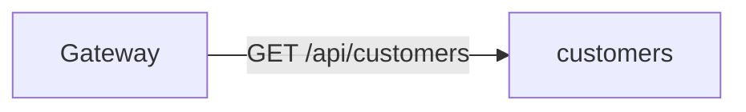

# customers

## Purpose

Sample customers service component.

## Composition

- HTTP API `GET /api/customers`

## Operation

List customers via HTTP.

### Schema

```mermaid
flowchart LR
  Gateway -->|"GET /api/customers"| customers
```
